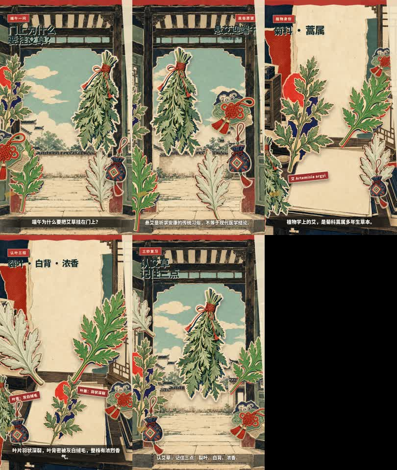

# 端午门前的艾草

- Preset: `paper-cut`
- Preview: 25.558 s, 720 × 1280, 30 fps, H.264/AAC
- Image provider: Codex native image generation
- Voice provider: Edge TTS `zh-CN-XiaoyiNeural`
- On-video account attribution: disabled

[播放预览 MP4](preview.mp4)

## 资料来源

- [植物智“艾”条目](https://www.iplant.cn/bk/24A3863B4BAE4324)：菊科蒿属多年生草本；叶羽状深裂，叶背密被白色绒毛，植株有浓香。
- [常州文明网“端午说艾”](https://wenming.changzhou.gov.cn/html/wmw/2025/MKLLQIBP_0529/82378.html)：记录江南地区端午在门前挂艾草的习俗，并描述艾的叶形与叶背白毛。

本片只介绍民俗与植物形态，不提供诊疗、用药或驱虫效果建议。旁白为 AI 合成语音。

图片为本项目示例专门生成，未复用参考文章截图；音乐与工具音效为程序化合成。媒体使用范围见 [../MEDIA-LICENSE.md](../MEDIA-LICENSE.md)。
