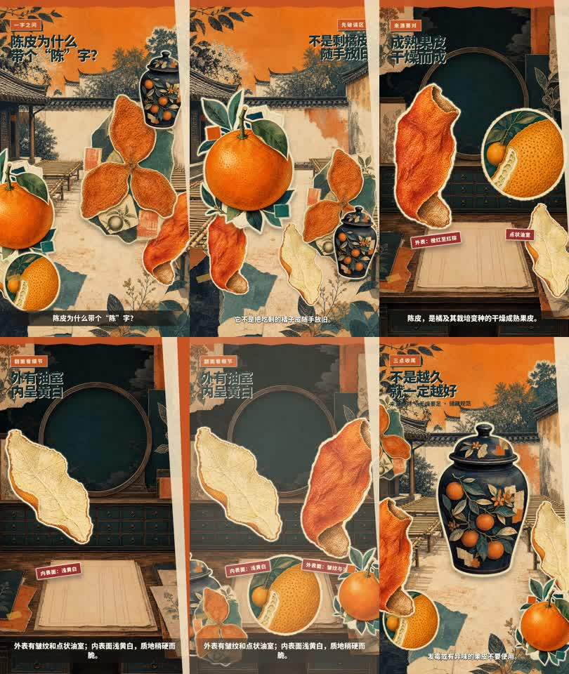

# 陈皮为什么带个“陈”字

- Preset: `paper-cut`
- Preview: 28.459 s, 720 × 1280, 30 fps, H.264/AAC
- Image provider: Codex native image generation
- Voice provider: Edge TTS `zh-CN-YunyangNeural`
- On-video account attribution: disabled

[播放预览 MP4](preview.mp4)

## 资料来源

- [香港浸会大学中医药学院“陈皮”](https://sys01.lib.hkbu.edu.hk/cmed/mmid/detail.php?pid=B00162)：药材来源、外表面、内表面、点状油室和质地描述。
- [香港卫生署中医药规管办公室“服药忌口和中药的储存方法”](https://www.cmro.gov.hk/html/gb/useful_information/public_health/feature_articles/Knowledge_of_Taking_Chinese_Medicines_Precautions_and_Storage_Method.html)：温度、湿度、光照和微生物会影响品质；一般情况下药材不宜存放过久。

本片只介绍药材来源、形态与储藏概念，不构成诊疗或用药建议。旁白为 AI 合成语音。

图片为本项目示例专门生成，未复用参考文章截图；音乐与工具音效为程序化合成。媒体使用范围见 [../MEDIA-LICENSE.md](../MEDIA-LICENSE.md)。
