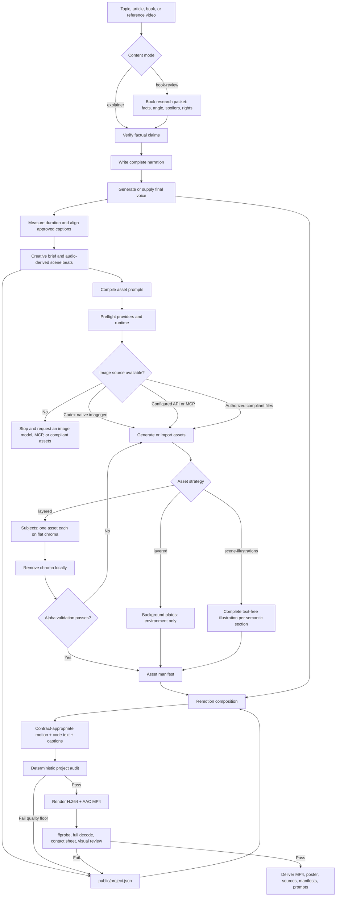

# Workflow map

## Responsibility split

| Stage | Capability | Required? |
|---|---|---|
| Script, evidence, and creative brief | General reasoning plus source research; book research packet for `book-review` | Yes |
| Visual assets | Raster image-generation model, MCP, or authorized strategy-compliant files | Yes |
| Chroma removal | Python plus Pillow | Only for chroma-based `layered` assets |
| Voice | Edge TTS, OpenAI Speech API, or authorized audio file | Yes for `book-review`; otherwise unless intentionally silent |
| Animation and compositing | Remotion | Yes in this Skill |
| Encoding and QA | FFmpeg and ffprobe | Yes |

The Skill orchestrates these capabilities. It is not itself a book database, image model, speech model, or renderer. Topic or book, palette, style preset, visual medium, subjects or scene illustrations, and shot layout live in the creative brief rather than stable prompt rules. The verified visual preset is `paper-cut`; other illustrated styles require their own tested asset and renderer contracts. WeRead, VoxCPM, faster-whisper, and HyperFrames are optional adapters, not required stages.
