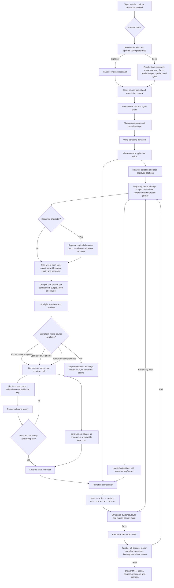

# Workflow map

## Research and story preparation

Resolve a planning duration before research. Ask once when the user omitted it. If the interaction cannot pause, no answer arrives, or the user asks to proceed, use about 40 seconds for `explainer` or 60–120 seconds for `book`. Record whether the value came from the user or the fallback. This is a narration scope budget, not a fixed timeline: after the text is approved, decoded final speech plus explicit handles determines exact frame timing for both modes.

Use that same opening exchange for an optional voice preference. Accept a provider or authorized supplied track, voice name when known, language or accent, requested perceived gender, delivery style, rate, and pitch. Do not make the user interpret raw IDs: when a real provider catalog is available, run `scripts/suggest-voices.mjs` and show three to five cards that explain sound, suitable situations, provider-declared gender and locale, real voice ID, and metadata-backed recommendation reason. Allow a short same-text preview when practical. Store the result as project configuration. The user's choice wins; without an answer, use the first real recommendation. When enumeration is unavailable, use only an existing configured catalog or verified project voice and never invent availability. If any final voice setting or approved wording changes, discard old timing anchors and derive the timeline again from the new decoded audio.

Research comes before narration and imagery. When multiple Agents and network access are available, divide work by responsibility rather than asking several Agents the same broad question:

| Research role | Typical responsibility |
|---|---|
| Bibliographic or foundational evidence | Official metadata, primary documents, authoritative definitions, dates, creator or publication context |
| Subject and story facts | Characters, chronology, mechanisms, setting, process steps, or claims needed for the chosen scope |
| Audience and angle | Public reviews, recurring questions, misconceptions, competing interpretations, and a useful entry point |
| Fact, spoiler, and rights review | Reconcile conflicts, label uncertainty and commentary, control plot disclosure, quotations, likenesses, and visual contamination |

Outputs are claim-source records, not a pile of search summaries. The writing Agent selects one tractable angle and turns it into a small narrative:

`attention question → concrete subject or incident → change or complication → consequence → useful resolution or open question`

This is a flexible story shape, not a mandatory five-scene template. Each beat must still record:

- narration purpose
- what becomes different by the end
- protagonist or core narrative object
- one observable visual verb
- movable evidence and depth/occlusion needs
- source IDs and uncertainty
- spoiler or rights risk when applicable

If the beat contains no visible change, shorten it, merge it, or mark it as an intentional bridge before asset planning.

## Layer planning

Every publishable scene is genuinely layered. The Agent decides the layer plan from the beat instead of assigning an identical count to every scene.

Three to seven independently addressable visual layers is a common range for a hero beat, but scenes may need fewer or more. The hard requirements are qualitative:

- the environment is separate and excludes the featured subject and movable core props
- the protagonist or core narrative object is independent
- objects that move, change state, or cross depth planes are independent
- foreground and rear occluders are separate when they carry the depth relationship
- camera motion is never the only visible motion

A beautiful full composite illustration is not a valid production scene. A collection of meaningless scraps is not a valid substitute for purposeful separation.

## Motion planning

For each primary subject and action-bearing prop:

1. `enterFrom` and `delay` establish the entrance and hierarchy.
2. `motion.action` names the observable verb tied to the narration.
3. `motion.keyframes` perform that action in scene-local progress.
4. `motion.loop` supplies restrained supporting life only when appropriate.
5. Late keyframes create a settle, exit, occlusion, state change, or handoff.

Use at least two meaningfully different keyframes for an action. Multiple character poses or object states remain separate alpha layers and crossfade with opacity keyframes. Avoid identical timing and perpetual bobbing across every layer.

## Responsibility split

| Stage | Capability | Required? |
|---|---|---|
| Research, evidence packet, and creative brief | General reasoning plus source research; specialized book research for `book` | Yes |
| Story beats and narration | Editorial reasoning grounded in the evidence packet | Yes |
| Visual assets | Raster image-generation model, MCP, or authorized contract-compliant files | Yes |
| Chroma removal | Python plus Pillow | When flat-key assets are used |
| Voice | Edge TTS, OpenAI Speech API, local model, or authorized audio file | Yes for `book`; otherwise unless intentionally silent |
| Timing | Manual alignment or optional speech-alignment tool using approved text | Yes |
| Animation and compositing | Remotion | Yes in this Skill |
| Encoding and QA | FFmpeg and ffprobe | Yes |

The Skill orchestrates these capabilities. It is not itself a research database, image model, speech model, or renderer. Topic, book, style, palette, characters, layer count, semantic actions, and shot layout remain project variables. Image generation must be available through Codex, an API, MCP, or compliant supplied assets. WeRead, VoxCPM, faster-whisper, HyperFrames, and other adapters are optional rather than required stages.

For implementation details, continue with [layer-contract.md](layer-contract.md), [prompt-standard.md](prompt-standard.md), [storyboard-schema.md](storyboard-schema.md), and [qa.md](qa.md). For book-specific evidence and character preparation, use [book-workflow.md](book-workflow.md).
