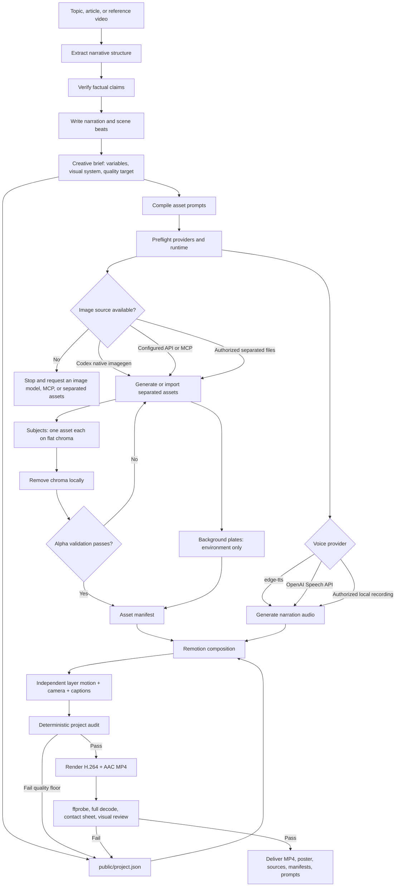

# Workflow map

## Responsibility split

| Stage | Capability | Required? |
|---|---|---|
| Script, evidence, and creative brief | General reasoning plus source research | Yes |
| Background and subjects | Raster image-generation model, MCP, or authorized separated files | Yes |
| Chroma removal | Python plus Pillow | Yes for chroma workflow |
| Voice | Edge TTS, OpenAI Speech API, or authorized audio file | Yes unless intentionally silent |
| Animation and compositing | Remotion | Yes in this Skill |
| Encoding and QA | FFmpeg and ffprobe | Yes |

The Skill orchestrates these capabilities. It is not itself an image model, speech model, or renderer. Topic, palette, style preset, visual medium, subject list, and shot layout live in the creative brief rather than stable prompt rules. The verified v1 preset is `paper-cut`; other illustrated styles require their own tested asset and renderer contracts.
